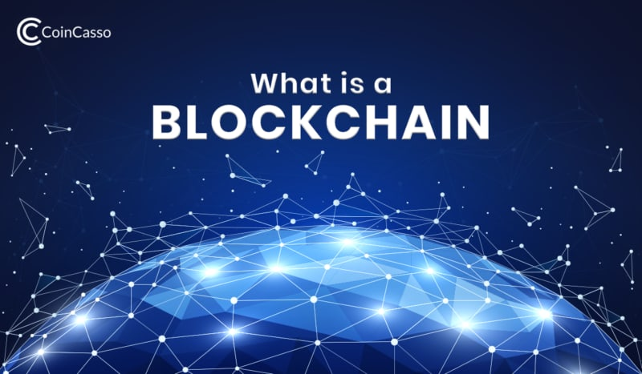

     
     
<!DOCTYPE html>
<html lang="ru" dir="itr">
  <head>
    <meta name="description" content="В современном мире происходит переоценка времени человека и многих других аспектов, поэтому все большее значение приобретает развитие таких технологий как блокчейн или смарт-контракты. Мы хотим поделиться с Вами увлекательной информацией о возможностях применения технологий блокчейна,нейронных сетей и смарт-контрактов."
    <meta name="keywords content="использование технологий в логистике,нейронные сети, смарт-контракты,блокчейн,нейросеть, логистика,применение технологий в логистике,использование технологий блокчейна смарт-контрактов нейронных сетей. "
    <body leftmargin="50" rightmargin="50" topmargin="60" bottommargin="50" link="#0066FF" vlink="#0066CC">
    <title>Главное меню</title>
    <link rel="stylesheet" href="style.css" type="text/css">
    <link rel="stylesheet" media="screen and (orientation: portrait) and 
    (max-width:640px), projection" href="style.css" />
    <link rel="stylesheet" media="screen and (orientation: portrait) and 
    (max-width:1024px), projection" href="style.css" />
    <link rel="stylesheet" media="screen and (orientation: portrait) and 
    (min-width:1280px), projection" href="style.css" />
   
    

      <a class="active" href="navigation.html">Главная страница</a>
      <a href="Vvedeniye.html">Краткая информация</a>
      <a href="blockchain.html">Блокчейн в логистике</a>
      <a href="neirocetb.html">Нейросеть в логистике</a>
      <a href="smart-kontrakti.html"> Смарт-контракты в логистике </a>
      <a href="contact.html">Контакты</a>
    

    <meta charset="utf-8" />
    <meta name="keywords" content="" />
  </head>
    <body leftmargin="50" rightmargin="50" topmargin="60" bottommargin="50" link="#0066FF" vlink="#0066CC">
        <blockquote>

               Приветствуем на нашем первом сайте ! На сегодняшний день в мире происходит переоценка времени человека и множества других аспектов, соответсвенно всё большее значение преобретают такие технологии как блокчейн,нейрооные сети и смарт-контракты.
                Мы хотим поделиться с Вами увлекательной информацией о возможностях применения технологий блокчейна,смарт-контрактов и нейросети.</blockquote></blockquote>
    
    
    
    </body>
     </html>
     
     
     
     <!DOCTYPE html>
<html lang="ru" dir="itr">
  <meta name="description" content="Технологии блокчейна становятся неотъемлемым элементом в развитии стартапов в сфере транспорта. Мы представляем список нескольких перспективных стартап-компаний, которые пытаются интегрировать блокчейн в логистику.">
<meta name="keywords" content= технология блокчейн, блокчейн,применение блокчейн,логистика,блокчейн в сфере логистики,развитие стартап компаний,логистические корпорации,развитие блокчейн,преимущества"
  <head>
    <meta name="description" content="
    <link rel="stylesheet" href="style.css" type="text/css">
    <link rel="stylesheet" media="screen and (orientation: portrait) and 
    (max-width:640px), projection" href="style.css" />
    <link rel="stylesheet" media="screen and (orientation: portrait) and 
    (max-width:1024px), projection" href="style.css" />   
    <link rel="stylesheet" media="screen and (orientation: portrait) and 
    (min-width:1280px), projection" href="style.css" />
    
    

       <a class="active" href="navigation.html">Главная страница</a>
       <a href="Vvedeniye.html">Краткая информация</a>
       <a href="blockchain.html">Блокчейн в логистике</a>
       <a href="neirocetb.html">Нейросеть в логистике</a>
       <a href="smart-kontrakti.html"> Смарт-контракты в логистике </a>
       <a href="contact.html">Контакты</a>
     

     <meta charset="utf-8" />
     <meta name="keywords" content="" />
   </head>
     <body leftmargin="50" rightmargin="50" topmargin="60" bottommargin="50" link="#0066FF" vlink="#0066CC">
    <title>Блокчейн в логистике</title>
  </head>
  <body>
    <blockquote><blockquote><blockquote><blockquote><blockquote><blockquote><blockquote>

      <h1>Значение блокчейна в логистике</h1>
      
        

          Из-за усложняющихся цепочек поставок крупные компании постоянно
          говорят о внедрении блокчейна в логистику, однако только единицы
          сделали это. Около трети фирм осваивают блокчейн и накапливают
          информацию. Следовательно, корпорации в основном используют для
          контакта друг с другом привычные методы коммуникации: электронная
          почта, телефон или мессенджеры.
        

        

          Тем временем требования людей растут, и необходимо осваивать новые
          пути связи с потребителем. Помимо этого, нужно обрабатывать большое
          количество информации и передавать ее другим сторонам. Во всем этом
          блокчейн может стать незаменимым помощником.
        

        

          В России в развитие искусственного интеллекта вкладывается немного
          средств. Тем не менее транспортная логистика пользуется популярностью
          у государства: в эту сферу поступает наибольшее количество инвестиций.
          Акцент делается на анализе информации, компьютерном распознавании
          видео и изображений и системе поддержки, самостоятельно принимающей
          решения.
        

        

  
        <h3>Примеры практического применения блокчейна в логистике:</h3>
        <ul>
          <li>ведение бизнеса без посредников;</li>
          <li>
            формирование автоматизированных операторов, не совершающих ошибки;
          </li>
          <li>контроль над платежами в режиме онлайн;</li>
          <li>
            хранение и обработка информации без использования бумажных
            носителей;
          </li>
          <li>отслеживание грузоперевозок;</li>
          <li>сокращение затрат на транспортные перевозки;</li>
          <li>защита от подделок товара или обмана.</li>
        </ul>
        

          Несколько десятилетий назад цепи поставок были просты: торговля
          происходила внутри регионов, и о доставке одного товара на другой
          континент и не мечтали. Однако времена меняются, и современные
          транспортные средства позволяют производить детали одного товара в
          разных странах. Логистика при этом усложнилась в разы.
        

        

          Эксперты считают, что надежности и прозрачности в сфере перевозок
          товаров возможно достичь при использовании технологии блокчейна. Это
          легко продемонстрировать следующим примером. Представим, что магазин
          одежды закупает товары у компании-производителя. Тот, в свою очередь,
          получает лен и прочие материалы из стран Азии. Торговля идет, и
          участники довольны сотрудничеством. Однако компания-производитель
          решает закупать лен более низкого качества. Обман или не обнаружится
          совсем, или только через какое-то время. В случае использования
          блокчейна мошенничество невозможно: данные хранятся в системе, и
          история транзакции не останется незамеченной для магазина одежды. Это
          один из примеров, как блокчейн гарантирует безопасность и уверенность
          сторон в соблюдении условий сделки другими.
        

        <h3>Примеры кейсов использования блокчейна</h3>
        

          Логистические корпорации мира следят за инновациями в области
          информационных технологий, чтобы реализовать некоторые новинки и
          успешные проекты в своем бизнесе. Первыми внедрили в логистику
          технологию блокчейн компании Maersk и IBM. Они перевели информацию о
          движении товаров и грузов в распределительный реестр. Дальше по этому
          пути пошла компания T-Mining: технология блокчейна самостоятельно
          передает задачи персоналу. Система оповещает грузчика о необходимости
          перевезти товар в указанное место.
        

        

          Корпорации, специализирующиеся в отрасли пищевых продуктов или
          лекарств, внедряют блокчейн в логистику. Организация Provenance таким
          образом контролирует качество поставляемых ингредиентов. Так
          проверяется пойманный в Океании тунец на предмет его «подлинности».
          Информация о перевозке рыбы отслеживается вплоть до ее доставки на
          кухню ресторана. Другой пример – компания Walmart, которая с помощью
          технологии блокчейна контролирует поставки свинины из Китая. Такой же
          алгоритм используют Nestle и Unilever.
        

        

          DeBeers, компания, добывающая алмазы, применяет блокчейн, чтобы
          следить за добычей и продажей своих алмазов. Так покупатель может быть
          уверен, что он не покупает драгоценные камни, добытые на территории
          военных действий, деньги от продажи которых будут использованы для
          покупки вооружения («кровавые алмазы»).
        

        

          Другая тенденция – создание организаций, заинтересованных во внедрении
          блокчейна в бизнес. Они создают специальные союзы. Один из них –
          американская BITA, состоящая из более чем 150 компаний. Их цель –
          продвижение технологии блокчейна на конференциях среди других
          организаций для улучшения и совершенствования процесса ведения
          бизнеса.
        

        

          Технология блокчейн в логистике ведет к повышению уровня безопасности
          и обеспечению сохранности данных. Она поможет избежать затрат на
          перевозки или задержек в доставке товаров. При этом случаи
          мошенничества сократятся в разы. Согласно докладу ВТО (Всемирная
          Торговая Организация), устранение барьеров в области международных
          перевозок товаров увеличит мировой ВВП на 5 процентов, а общий объем
          перевозок – на 15.
        

        <h3>В заключении</h3>
        

          Внедрение Blockchain в логистику обеспечит сохранность данных, защиту
          репозитория документов от взлома, устранит возможность внесения
          изменения информации о ходе перевозки. Такая система определённо может
          сократить задержки доставки и уменьшить вероятность мошенничества,
          сохраняя миллиарды долларов всем участником цепи перевозок. Согласно
          Всемирной Торговой Организации, устранение барьеров в цепи
          международных поставок товаров позволит увеличить мировой ВВП на 5% и
          общий объём перевозок на 15%.
        

      
    </blockquote>
  </body>
</html>
<!DOCTYPE html>
<html lang="ru" dir="itr">
  <meta name="description" content="Нейронные сети  помогают логистическим компаниям видеть, понимать и взаимодействовать с миром быстрее и эффективнее, чем когда-либо. Мы считаем, что будущее нейронных сетей в логистике очень перспективное. Какие нововведения принесла нейросеть в сферу транспортных услуг и каковы его применения в логистики?">
  <meta name="keywords" content="искусственный интеллект в логистике, нейросеть и логистика, развитие нейросети в логистике, технологии искусственного интеллекта в логистике, примеры использования нейронных сетей в логистике, внедрение нейросетей">
  <head>
    <link rel="stylesheet" href="style.css" type="text/css">
    <link rel="stylesheet" media="screen and (orientation: portrait) and 
    (max-width:640px), projection" href="style.css" />    
    <link rel="stylesheet" media="screen and (orientation: portrait) and 
    (max-width:1024px), projection" href="style.css" /> 
    <link rel="stylesheet" media="screen and (orientation: portrait) and 
    (min-width:1280px), projection" href="style.css" />
    
     

       <a class="active" href="navigation.html">Главная страница</a>
       <a href="Vvedeniye.html">Краткая информация</a>
       <a href="blockchain.html">Блокчейн в логистике</a>
       <a href="neirocetb.html">Нейросеть в логистике</a>
       <a href="smart-kontrakti.html"> Смарт-контракты в логистике </a>
       <a href="contact.html">Контакты</a>
     

     <meta charset="utf-8" />
     <meta name="keywords" content="" />
   </head>
     <body leftmargin="50" rightmargin="50" topmargin="60" bottommargin="50" link="#0066FF" vlink="#0066CC">
     <blockquote><blockquote><blockquote><blockquote><blockquote><blockquote><blockquote>

      <h1>Значение нейронных сетей в логистике</h1>
      
        

          В настоящий момент нейронные сети начинают использоваться во многих
          областях: медицине, бизнесе, аналитике и других. Самый популярный
          пример использования нейронных сетей — это распознавание изображений и
          речи.  Сегодня нейронные сети начинают использоваться в
          транспортной логистике для анализа и моделирования транспортных
          потоков и для верного распределения ресурсов (транспорта, пассажиров)
          на транспортных потоках. Все это используется для оптимизации потоков.
        

        

  
        

          Свою силу нейронные сети черпают, во-первых, из распараллеливания
          обработки информации и, во-вторых, из способности самообучаться, т.е.
          создавать обобщения. Под термином обобщение понимается способность
          получать обоснованный результат на основании данных, которые не
          встречались в процессе обучения. Эти свойства позволяют нейронным
          сетям решать сложные (масштабные) задачи, которые на сегодняшний день
          считаются трудноразрешимыми. Однако на практике при автономной работе
          нейронные сети не могут обеспечить готовые решения. Их необходимо
          интегрировать в сложные системы. В частности, комплексную задачу можно
          разбить на последовательность относительно простых задач, часть из
          которых может решаться нейронными сетями.
        

        <h3>
          Использование нейронных сетей обеспечивает следующие полезные
          свойства:
        </h3>
        <ul>
          <li>
            Нелинейность - искусственные нейроны могут быть линейными и
            нелинейными. Нейронные сети, построенные из соединений нелинейных
            нейронов, сами являются нелинейными. Более того, эта нелинейность
            особого рода, так как она распределена по сети. Нелинейность
            является важным свойством, особенно если механизм, отвечающий за
            формирование входного сигнала, тоже является нелинейным.
          </li>
          <li>
            Отказоустойчивость - нейронные сети, облаченные в форму электроники,
            потенциально отказоустойчивы. Это значит, что при неблагоприятных
            условиях их производительность падает незначительно. Незначительное
            повреждение структуры никогда не вызывает катастрофических
            последствий.
          </li>
          <li>
            Адаптивность - нейронные сети обладают способностью адаптировать
            свои синаптические веса к изменениям внешней среды. В частности,
            сети обученные действовать в определенной среде могут быть легко
            переучены для работы в условиях незначительных колебаний параметров
            среды. Более того, для работы в нестационарной среде могут быть
            созданы нейронные сети, изменяющие синаптические веса в реальном
            времени. При этом хотелось бы заметить, что адаптивность не всегда
            ведет к устойчивости, например, адаптивная система с параметрами,
            быстро изменяющимися во времени, может также быстро реагировать и на
            посторонние возбуждения, что вызовет потерю производительности.
          </li>
          <li>
            Единообразие анализа и проектирования - нейронные сети являются
            универсальным механизмом обработки информации. Это означает, что
            одно и то же проектное решение нейронной сети может использоваться
            во многих предметных областях.
          </li>
        </ul>
        

  
        

          Еще одним важным преимуществом внедрения ИИ и автоматизации в
          логистической отрасли является тот факт, что эти технологии могут
          сыграть огромную роль в повышении точности и эффективности обработки
          цепочки поставок.  С помощью искусственного интеллекта
          логистические компании могут более эффективно управлять всеми
          процессами цепочки поставок с помощью упреждающей системы логистики.
          Основное ожидание клиентов логистических компаний – доставка заказов
          как можно быстрее. В результате компании используют систему
          упреждающей логистики, чтобы определить, наблюдается ли увеличение или
          уменьшение спроса со стороны их клиентов, и скорректировать объем
          производства в соответствии с тенденцией.
        

        

          Нейронная сеть, внедренная в логистические компании, может привести к
          улучшению процесса управления и анализа огромных объемов данных.
          Электронные таблицы и другие устаревшие системы больше не являются
          эффективным методом управления данными. Таким образом, искусственный
          интеллект появился, когда информация и данные начали достигать
          невообразимых количеств в логистической отрасли. Логистические
          компании генерируют и ежедневно обрабатывают огромные объемы данных.
          Раньше это было реальной проблемой для сотрудников до внедрения ИИ и
          автоматизации.
        

        <h3>В заключении</h3>
        

          Внедрение нейронных сетей и автоматизации в логистических компаниях
          может поднять производительность на совершенно новый уровень.
          Индустрия логистики начала внедрять технологии, чтобы улучшить
          обработку цепочек поставок, повысить удовлетворенность клиентов и
          создать более безопасную и здоровую рабочую среду для работников.
        

        

          Внедрение ИИ и автоматизации в сфере логистики может оказать огромное
          влияние на снижение затрат. Меньшее количество ошибок при принятии
          решений человеком может привести к снижению затрат для логистических
          компаний.Системы отслеживания в режиме реального времени, системы
          упреждающей логистики и возможность управлять большими объемами данных
          в течение нескольких секунд приводят к более быстрой доставке,
          меньшему количеству человеческих ошибок, меньшему количеству
          потерянных или ошибочно доставленных заказов и, очевидно, к повышению
          удовлетворенности клиентов.
        

      
    </blockquote>
  </body>
</html>
<!DOCTYPE html>
<html lang="ru" dir="itr">
  <head>
    <meta name="description" content="Смарт-контракты (smart-kontrakti, SC) можно рассматривать как один из наборов инструментов, который способен повысить эффективность бизнес-процессов. Раскроем возможности и перспективы применения смарт-контрактов в области логистики и транспорта.">
<meta name="keywords" content= "смарт-контракты, применение смарт контрактов, что такое смарт-котракты,технология смарт-контрактов,смарт-котракты в логистике">
    <body leftmargin="50" rightmargin="50" topmargin="60" bottommargin="50" link="#0066FF" vlink="#0066CC">
    <title>Смарт-контракты в логистике</title>
    <link rel="stylesheet" href="style.css" type="text/css">
    <link rel="stylesheet" media="screen and (orientation: portrait) and 
    (max-width:640px), projection" href="style.css" />
    <link rel="stylesheet" media="screen and (orientation: portrait) and 
    (max-width:1024px), projection" href="style.css" />
    <link rel="stylesheet" media="screen and (orientation: portrait) and 
    (min-width:1280px), projection" href="style.css" />
   
    

      <a class="active" href="navigation.html">Главная страница</a>
      <a href="Vvedeniye.html">Краткая информация</a>
      <a href="blockchain.html">Блокчейн в логистике</a>
      <a href="neirocetb.html">Нейросеть в логистике</a>
      <a href="smart-kontrakti.html"> Смарт-контракты в логистике </a>
      <a href="contact.html">Контакты</a>
    

  </head>
    <body leftmargin="50" rightmargin="50" topmargin="60" bottommargin="50" link="#0066FF" vlink="#0066CC">
    <blockquote><blockquote><blockquote><blockquote><blockquote><blockquote><blockquote>

      <h1>Cмарт-контракты, где можно их применять и при чём тут блокчейн</h1>
      
        

          Реальное практическое применение смарт-контрактам нашлось с появлением
          технологии блокчейн. Децентрализованные системы на основе блокчейна —
          та среда, в которой выполнение смарт-контракта не зависит от третьего
          лица, а его код нельзя произвольно изменить. Вне такой среды
          смарт-контракт будет просто программным кодом.
        

        

  
        

          Важный параметр смарт-контракта на блокчейне — полнота по Тьюрингу.
          Простыми словами, полнота по Тьюрингу — это возможность системы
          выполнить любую вычислимую функцию. То есть Тьюринг-полной будет
          система, которая может выполнить любую компьютерную программу.
        

        

          Блокчейн Ethereum работает со смарт-контрактами на Тьюринг-полном
          языке программирования Solidity. Solidity позволяет создавать более
          сложные алгоритмы, но такие смарт-контракты гораздо сложнее проверить
          на наличие уязвимостей.
        

        <h3>Где можно применять смарт-контракты?</h3>
        <h4>Цепочки поставок</h4>
        

          Смарт-контракты и блокчейн — актуальное решение для обслуживания
          цепочки поставок от сырья до готовых продуктов. Чаще всего
          сопроводительная информация для каждого из этапов хранится в отдельных
          базах данных, а бумажные документы до сих пор приходится пересылать
          физически. Чтобы собрать один ноутбук, кому-то нужно добыть нефть и
          металлы, из которых кто-то сделает пластиковый гранулят и нужные
          сплавы, которые впоследствии превратятся в детали и попадут в
          сборочный цех. На каждом из этапов нужно передавать и подписывать
          документы, высылать счета, переводить деньги и т. д. Всю эту
          информацию можно объединить в одном реестре, чтобы всем сторонам были
          доступны документы, история транзакций и поставок. Смарт-контракты
          позволят автоматически распределять платежи после согласования и
          получения нужных цифровых подписей. Кроме того, в цепочку поставок на
          блокчейне значительно проще добавлять новых участников вроде
          поставщиков и перевозчиков.
        

        <h4>Продажа интернет вещей</h4>
        

          В интернете вещей (Internet of Things, IoT) безопасность и
          неизменяемость блокчейн-реестра вместе с возможностями
          смарт-контрактов позволят наладить прозрачные механизмы взаимодействия
          и обмена ценностями между гаджетами вроде умных холодильников,
          смартфонов, термостатов и автомобилей. Умный электромобиль может одной
          транзакцией инициировать оплату за электричество и смарт-контракт
          активирует зарядное устройство. Права владения этими гаджетами тоже
          можно фиксировать в блокчейне, а значит, пользователь сможет продать
          или подарить устройство не покидая блокчейн-сети и без привлечения
          третьих лиц.
        

        

  
        <h3>Проблемы смарт-контрактов</h3>
        

          Одна из основных технических преград полномасштабному внедрению
          блокчейн-реестра и смарт-контрактов — необходимость создать
          эффективные и надёжные оракулы. Оракулы — это внешние агенты, которые
          отвечают за достоверность предоставленной информации извне.
        

        

          Блокчейн-реестр — изолированная среда, внутри которой с помощью
          криптографических доказательств и протоколов консенсуса все участники
          могут проверить истинность тех или иных данных. Но для широкого
          применения этим системам нужно получать информацию из внешнего мира:
          подтверждать факт получения товара, идентифицировать участников,
          получать биржевые сводки и так далее. Такая информация поступает в
          систему через оракулы.
        

        
Оракулами могут быть:

        <ul>
          <li>
            измерительные приборы вроде термометра или датчика освещенности;
          </li>
          <li>
            конкретные участники сети, которые оказывают услуги
            блокчейн-системе;
          </li>
          <li>
            децентрализованные системы с собственными механизмами консенсуса,
            построенные поверх основного реестра.
          </li>
        </ul>
        

          Уже сейчас многие традиционные банки и ведомства экспериментируют с
          блокчейн-технологиями и смарт-контрактами и инвестируют в проекты в
          этой отрасли. По мере того, как проекты вроде Augur, Aeternity и
          Oraclize решают проблему оракулов и совершенствуют технологию, всё
          больше государственных структур и бизнесов будут внедрять
          распределённый реестр и смарт-контракты для оптимизации своей работы и
          прозрачного учёта.
        

        

          Смарт-контракты уже сейчас могут заменить значительную часть
          существующего документооборота. Любые типовые соглашения о страховании
          или передаче имущества можно реализовать как смарт-контракты. Однако
          для нестандартных случаев традиционные контракты останутся основным
          элементом соглашения. В роли базиса для распределённых приложений и
          аналога обычной компьютерной программы для распределённой среды
          смарт-контракты скорее всего будут использоваться практически
          повсеместно.
        

      
    </blockquote>
  </body>
</html>

.menu {
  list-style-type: none;
  padding-left: 0;
  margin-left: 0;
}
.menu a {
  text-decoration: none;
  font-family: sans-serif;
  color: gray;
  display: inline-block;
  padding: 10px 20px;
  background-color: fff2bc;
  border-bottom: 5x solid gray;
}
.menu li {
  float: left;
}

<!DOCTYPE html>
<html lang="ru" dir="itr">
  <head>
    <meta name="description" content="В современном мире происходит переоценка времени человека и многих других аспектов, поэтому все большее значение приобретает развитие таких технологий как блокчейн или смарт-контракты. Мы хотим поделиться с Вами увлекательной информацией о возможностях применения технологий блокчейна,нейронных сетей и смарт-контрактов."
    <meta name="keywords content="использование технологий в логистике,нейронные сети, смарт-контракты,блокчейн,нейросеть, логистика,применение технологий в логистике,использование технологий блокчейна смарт-контрактов нейронных сетей. "
    <body leftmargin="50" rightmargin="50" topmargin="60" bottommargin="50" link="#0066FF" vlink="#0066CC">
    <title>Смарт-контракты в логистике</title>
    <link rel="stylesheet" href="style.css" type="text/css">
    <link rel="stylesheet" media="screen and (orientation: portrait) and 
    (max-width:640px), projection" href="style.css" />
    <link rel="stylesheet" media="screen and (orientation: portrait) and 
    (max-width:1024px), projection" href="style.css" />
    <link rel="stylesheet" media="screen and (orientation: portrait) and 
    (min-width:1280px), projection" href="style.css" />
   
    

      <a class="active" href="navigation.html">Главная страница</a>
      <a href="Vvedeniye.html">Краткая информация</a>
      <a href="blockchain.html">Блокчейн в логистике</a>
      <a href="neirocetb.html">Нейросеть в логистике</a>
      <a href="smart-kontrakti.html"> Смарт-контракты в логистике </a>
      <a href="contact.html">Контакты</a>
    

    <meta charset="utf-8" />
    <meta name="keywords" content="" />
  </head>
    <body leftmargin="50" rightmargin="50" topmargin="60" bottommargin="50" link="#0066FF" vlink="#0066CC">
<blockquote><blockquote><blockquote><blockquote><blockquote><blockquote><blockquote>

      <h1>Введение</h1>
      <h3>О блокчейне</h3>
      
       
Блокчейн (Blockchain) это выстроенная по определённым правилам непрерывная последовательная цепочка блоков, содержащих информацию. Блокчейн как вечный цифровой распределённый журнал экономических транзакций, который может быть запрограммирован для записи не только финансовых операций в качестве криптовалюты, но и практически всего, что имеет ценность. Но такое определение не даёт достаточного понимания, что это такое и как он работает. Рассмотрим блокчейн более подробно и постараемся просто и доходчиво объяснить, что же это за технология.

       

  
        <h3>Блокчейн — это универсальный инструмент для построения различных баз данных, который обладает следующими преимуществами:</h3>
<ul>
 <li><b>Децентрализация.</b> Отсутствует главный сервер хранения данных. Все записи хранятся у каждого участника системы.</li>  
 <li><b>Полная прозрачность.</b> Любой участник может отследить все транзакции, проходившие в системе.</li>
 <li><b>Конфиденциальность.</b> Все данные хранятся в зашифрованном виде. Пользователь может отследить все транзакции, но не может идентифицировать получателя или отправителя информации, если он не знает номера кошелька. Для проведения операций требуется уникальный ключ доступа.</li>  
 <li><b>Надёжность.</b> Любая попытка внесения несанкционированных изменений будет отклонена из-за несоответствия предыдущим копиям. Для легального изменения данных требуется специальный уникальный код, выданный и подтверждённый системой.</li>
</ul>

Позволяя цифровой информации распространяться, но не копироваться, технология блокчейн создала основу нового вида интернета. Технология была первоначально разработана для цифровой валюты, биткоина, но в настоящее время техническое сообщество ищет другие потенциальные варианты использования данной технологии.

<h3>Как это работает?</h3>

 Базовая система блокчейна представляет из себя постоянно растущую последовательность блоков, которые разделяются между участниками с помощью пиринговых сетей, которыми большинство людей пользуются для скачки и раздачи торрентов.
    В каждый блок добавляется временная отметка (хэш-сумма), которую проще всего представить как уникальный отпечаток пальца. Эти блоки строго в определенном порядке складываются в цепочки («blockchain» — буквально «цепь блоков»). Если попытаться переставить последовательность блоков, то система отвергнет цепь из-за несоответствия структуры и хеш-суммы. 
 
<h3>О нейросети</h3>

Нейронные сети — это такой набор связей и алгоритмов, который прямо сейчас работает в нашем мозге. При помощи этого набора мы видим, анализируем и принимаем решения. И вышло так, что программисты взяли и переложили этот принцип в компьютерные сети. Теперь одно изображение от другого отличают не биологические процессы, а машинный код.

  

До широкой аудитории доходят только громкие случаи применения нейросетей. Например, когда нейросеть Яндекса записывает музыкальный альбом или ребята из Беларуси снимают короткометражку по сценарию, который написала машина. Всё это громко, необычно, но бесполезно. Основная цель таких акций — привлечь внимание к технологии, показать всю ее необычность и силу. Такие громкие инфоповоды помогают людям увидеть, что будущее уже наступило.

Но на самом деле, нейросети каждый день выполняют задачи. Например, алгоритм Brain на основе нейросетей ежедневно работает над системой рекомендаций Ютуба. Он подбирает для пользователей релевантный контент, изучая их поведение. Поэтому ролики часто набирают просмотры не за счет прямого трафика, когда пользователь вводит запрос в поисковую строку, а тогда, когда система сама предлагает ему потенциально интересный контент.

В 2018 году нейросети вышли из закрытых лабораторий и теперь доступны в виде библиотек и фреймворков. Сейчас основная сложность — это тренировка нейросети при помощи Больших данных. Но компании поменьше тоже могут использовать нейросети для своих задач, необязательно быть Google или Yandex. Например, нейросети находят ответ на вопрос даже с неявной формулировкой. Алгоритмы word2vec определяют „векторы вопросов“ и ищут сходства в базе ответов. По подобному принципу работает AnswerBot в Zendesk. Еще нейросети автоматизируют Helpdesk. Программа назначает ответственных и ставит приоритеты без участия первой линии техподдержки. Мы реализовали подобную нейросеть для ITSM-системы ServiceNow. Нейросети используются и в лидскоринговых сервисах, которые оценивают поведение пользователей на сайте и предлагают им релевантные уведомления, спецпредложения и акции»

<h3>Про смарт-контракты</h3>

  

          
Принцип интеллектуальных контрактов был описан американским криптографом и программистом Ником Сабо еще в 1996 году задолго до появления технологии blockchain. Согласно концепции Сабо, интеллектуальные контракты — это цифровые протоколы для передачи информации, которые используют математические алгоритмы для автоматического выполнения транзакции после выполнения установленных условий и полного контроля процесса. Это определение, которое опережало свое время более чем на десять лет, остается точным и по сей день. Однако в 1996 году эта концепция не могла быть реализована: в то время необходимые технологии не существовали, в частности, распределенная книга.

      
В 2008 году появился bitcoin, появилась первая криптовалюта, созданная на основе революционной технологии blockchain, которой ранее не хватало децентрализованной книги. Blockchain биткоина не позволяет устанавливать условия для совершения транзакции в новом блоке, поскольку он содержит только информацию о самой транзакции. Тем не менее появление технологии послужило толчком для разработки смарт-контрактов. Спустя пять лет блочная платформа Ethereum позволила использовать смарт-контракты на практике. Сегодня рынок предлагает множество платформ, которые позволяют использовать смарт-контракты, но Ethereum остается одним из самых распространенных.

        <h4>Как работают смарт-контракты</h4>
      
Код используется для ввода всех условий договора, заключенного между сторонами сделки, в blockchain. Обязательства участников предоставляются в интеллектуальном контракте в форме «если- то» (например: «если Сторона А переводит деньги, тогда Сторона В, передает права на квартиру»). Могут быть два или более участников, и они могут быть отдельными лицами или организациями. Как только данные условия будут выполнены, смарт-контракт самостоятельно выполняет транзакцию и гарантирует, что соглашение будет соблюдаться.

      
Смарт-контракты позволяют обменять деньги, товары, недвижимость, ценные бумаги и другие активы. Контракт хранится и повторяются в децентрализованной книге, в которой информация не может быть сфальсифицирована или удалена. В то же время шифрование данных обеспечивает анонимность сторон соглашения. Важной особенностью интеллектуальных контрактов является то, что они могут работать только с активами, находящимися в их цифровой экосистеме. Как подключить виртуальный и реальный мир в настоящее время является одной из основных трудностей работы со смарт-контрактами. Это является причиной существования «оракулов», специальных программ, которые помогают компьютерным протоколам получать необходимую информацию из реального мира.

<h3>Преимущества смарт-контрактов</h3>
<ul>
    <li><b>Скорость.</b> Обработка документов вручную занимает много времени и задерживает выполнение задач. Смарт- контракты предполагают автоматизированный процесс и в большинстве случаев не требуют личного участия, что экономит драгоценное время.</li>
    <li><b>Независимость.</b> Смарт-контракты исключают возможность вмешательства третьих сторон. Гарантия на транзакцию — сама программа, которая, в отличие от посредников, не даст основания сомневаться в ее целостности.</li>
    <li><b>Надежность.</b> Данные, записанные в blockchain, не могут быть изменены или уничтожены. Если одна сторона сделки не выполняет свои обязательства, другая сторона будет защищена условиями интеллектуального договора.</li>
    <li><b>Сбережения</b> Смарт-контракты могут обеспечить значительную экономию за счет устранения расходов для посредников и сокращения операционных расходов, а также возможность для сторон работать вместе на более выгодных условиях.</li>
</ul>

      </blockquote>
    </body>
</html>

